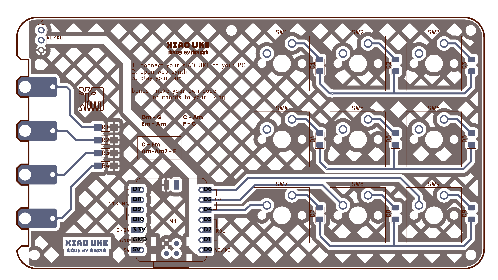
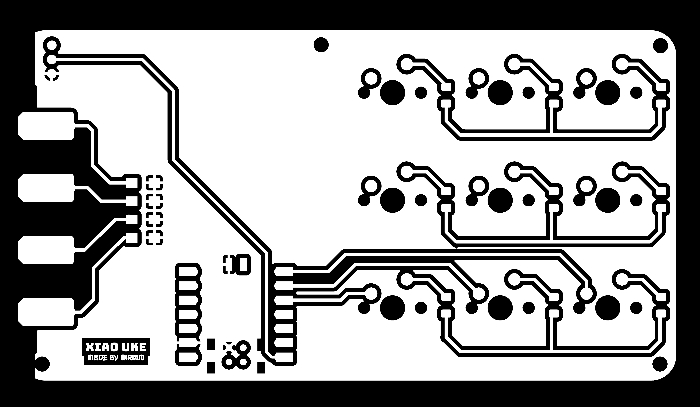
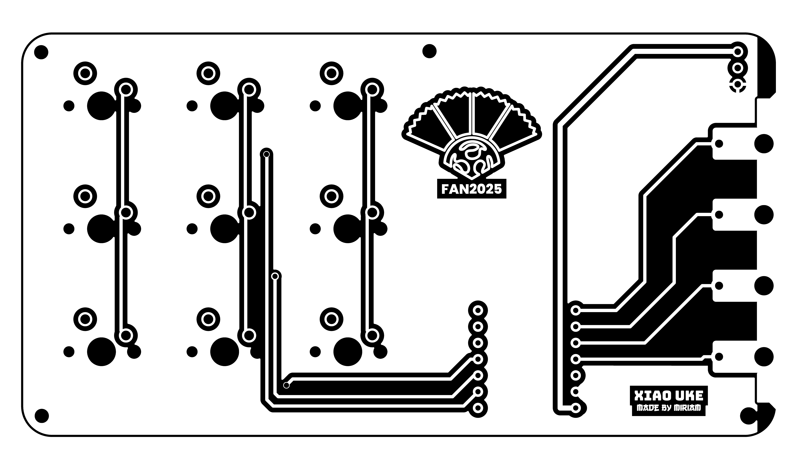

# XIAO-UKE

## Bill of Materials - PCB Components

|  | **Component** | **Quantity** | **Description** |
| --- | --- | --- | --- |
| M1 | XIAO RP2040 | 1 | Microcontroller board |
|  | XIAO connector pin 1x7 | 2 | Connector pins for Xiao board |
| J1 | Neopixel strip of 7 /or 3pin potentiometer | 1 | for light effect of switch |
| SW1-9 | Keyboard switch | 9 | Mechanical keyboard switches |
| D1-9 | 1N4148 Diode | 9 | Switching diode |
| R 1-4 | 1MΩ resistor | 4 | for Capacitive touch |
|  | Key cap | 9 | Printed or commercial key caps |
|  | XIAO UKE board | 1 | Custom PCB |

## PCB







| Item | sell price |
| --- | --- |
| PCB board  | 150 Yuan |
| smd components (diodes and resistor) for the kit | 10 Yuan |
| switches X 9  | 20 Yuan |
| XIAO RP2040 (code for project Preloaded) | 30 Yuan |
| Full Kit (not assembled) | 200 Yuan |
| Assembled Full Kit | 250 Yuan |

HOW TO USE.

What to download

circuitPython for XIAO RP2040

what to install

Thonny

websynth

1. Plug in XIAO RP2040
2. download circuitpython for XIAO RP2040
    
    [CircuitPython - Seeed Studio XIAO RP2040 Download](https://circuitpython.org/board/seeeduino_xiao_rp2040/)
    
3. drag the file into the XIAO RP2040 folder.
    1. it should reset and open as circuitpython
4. download the  adafruit circuitpython library bundle
    1. make sure it is the correct version depending on your version of circuitpython
    
    [CircuitPython - Libraries](https://circuitpython.org/libraries)
    
5. open Thonny
6. try out the debug code to see if your keys and touch pad all work properly.

### Code: debug soldering input output check

```python
# ukulele_hardware_check_clean.py
# CircuitPython debug/test for ukulele PCB
# Checks matrix switches, capacitive pads, and NeoPixel strip

import board
import digitalio
import touchio
import neopixel
import time

# ---------------- Pins ----------------
ROW_PINS = [board.D1, board.D2, board.D3]
COL_PINS = [board.D4, board.D5, board.D6]
TOUCH_PINS = [board.D7, board.D8, board.D9, board.D10]
PIXEL_PIN = board.D0
NUM_LEDS = 7

# ---------------- Setup ----------------
rows = [digitalio.DigitalInOut(p) for p in ROW_PINS]
for r in rows:
    r.direction = digitalio.Direction.INPUT

cols = [digitalio.DigitalInOut(p) for p in COL_PINS]
for c in cols:
    c.direction = digitalio.Direction.INPUT
    c.pull = digitalio.Pull.UP

touches = [touchio.TouchIn(p) for p in TOUCH_PINS]
for t in touches:
    t.threshold = 1200

pixels = neopixel.NeoPixel(PIXEL_PIN, NUM_LEDS, brightness=0.4, auto_write=True)

# ---------------- Matrix Helpers ----------------
def set_row_active(i):
    for r in rows:
        r.direction = digitalio.Direction.INPUT
    rows[i].direction = digitalio.Direction.OUTPUT
    rows[i].value = False

def release_rows():
    for r in rows:
        r.direction = digitalio.Direction.INPUT

# ---------------- LED Test ----------------
print("Testing NeoPixel strip...")
for i in range(NUM_LEDS):
    pixels.fill((0, 0, 0))
    pixels[i] = (255, 100, 0)
    print("LED", i + 1, "ON")
    time.sleep(0.2)
pixels.fill((0, 0, 0))
print("LED test complete\n")

# ---------------- Button + Touch Test ----------------
print("Testing matrix and touch inputs...\n")

while True:
    # Matrix keys
    for r in range(len(rows)):
        set_row_active(r)
        time.sleep(0.001)
        for c in range(len(cols)):
            if not cols[c].value:
                key_id = r * len(cols) + c
                print("Key", key_id + 1, "pressed (Row", r, "Col", c, ")")
                pixels.fill((0, 255, 0))
                pixels[key_id % NUM_LEDS] = (255, 0, 0)
                time.sleep(0.2)
                pixels.fill((0, 0, 0))
        release_rows()

    # Touch pads
    for i, t in enumerate(touches):
        if t.value:
            print("Touch Pad", i + 1, "active")
            pixels.fill((0, 0, 255))
            pixels[i % NUM_LEDS] = (255, 255, 255)
            time.sleep(0.2)
            pixels.fill((0, 0, 0))

    time.sleep(0.01)

```

### Code: Neopixel Full Ukulele (MIDI)

```python
# ukulele_midi_7led_fast.py
# CircuitPython ukulele controller — fast touch response
# 3×3 matrix, 4 capacitive strings, 7-LED NeoPixel strip
# Hardware:
# Rows: D1-D3
# Cols: D4-D6
# NeoPixel strip: D0 (7 LEDs)
# Touch pads (G,C,E,A): D7-D10
# Requires adafruit_midi and neopixel libraries

import board, digitalio, touchio, neopixel, time
import usb_midi
import adafruit_midi
from adafruit_midi.note_on import NoteOn
from adafruit_midi.note_off import NoteOff

# ---------------- Pins ----------------
ROW_PINS = [board.D1, board.D2, board.D3]
COL_PINS = [board.D4, board.D5, board.D6]
TOUCH_PINS = [board.D7, board.D8, board.D9, board.D10]
PIXEL_PIN = board.D0
NUM_LEDS = 7

pixels = neopixel.NeoPixel(PIXEL_PIN, NUM_LEDS, brightness=0.4, auto_write=False)

# ---------------- MIDI ----------------
midi = adafruit_midi.MIDI(midi_out=usb_midi.ports[1], out_channel=0)
MIDI_ROOTS = [60, 62, 64, 65, 67, 69, 71]  # C D E F G A B

# ---------------- Colors ----------------
COLOR_MAJOR  = (255, 100, 180)
COLOR_MINOR  = (255, 255, 0)
COLOR_7TH    = (0, 100, 255)
COLOR_MINOR7 = (100, 255, 255)
COLOR_OFF    = (0, 0, 0)
COLOR_NEUTRAL= (80, 80, 80)

# ---------------- States ----------------
minor_pressed = False
seventh_pressed = False
key_states = [False] * 9
last_touch_vals = [False] * 4
shimmer_queue = []  # for non-blocking shimmer

# ---------------- Matrix setup ----------------
rows = [digitalio.DigitalInOut(p) for p in ROW_PINS]
for r in rows: r.direction = digitalio.Direction.INPUT

cols = [digitalio.DigitalInOut(p) for p in COL_PINS]
for c in cols:
    c.direction = digitalio.Direction.INPUT
    c.pull = digitalio.Pull.UP

NUM_ROWS = len(rows)
NUM_COLS = len(cols)
DEBOUNCE_MS = 20
state = [[0]*NUM_COLS for _ in range(NUM_ROWS)]
last_change_ts = [[0]*NUM_COLS for _ in range(NUM_ROWS)]

# ---------------- Touch setup ----------------
touches = [touchio.TouchIn(p) for p in TOUCH_PINS]
for t in touches:
    t.threshold = 1200  # faster, more sensitive response

# ---------------- Helpers ----------------
def set_row_active(i):
    for r in rows: r.direction = digitalio.Direction.INPUT
    rows[i].direction = digitalio.Direction.OUTPUT
    rows[i].value = False

def release_rows():
    for r in rows: r.direction = digitalio.Direction.INPUT

def chord_color():
    if minor_pressed and seventh_pressed: return COLOR_MINOR7
    if minor_pressed: return COLOR_MINOR
    if seventh_pressed: return COLOR_7TH
    return COLOR_MAJOR

def update_leds():
    color = chord_color()
    for i in range(7):
        pixels[i] = color if key_states[i] else COLOR_OFF
    pixels.show()

def add_shimmer(color, steps=5):
    """Add shimmer to queue (non-blocking)"""
    shimmer_queue.append({'color': color, 'step': 1, 'steps': steps})

def process_shimmer():
    """Non-blocking shimmer update"""
    if not shimmer_queue: return
    finished = []
    for s in shimmer_queue:
        step = s['step']
        steps = s['steps']
        c = s['color']
        r,g,b = tuple(int(v*step/steps) for v in c)
        pixels.fill((r,g,b))
        pixels.show()
        s['step'] +=1
        if s['step'] > steps:
            finished.append(s)
    for f in finished: shimmer_queue.remove(f)
    # After shimmer, restore normal LED state
    if not shimmer_queue:
        update_leds()

def handle_key_event(r, c, pressed):
    global minor_pressed, seventh_pressed
    idx = r*NUM_COLS + c
    key_states[idx] = pressed
    if idx == 7: minor_pressed = pressed
    elif idx == 8: seventh_pressed = pressed
    update_leds()

def get_chord_notes(root):
    fifth = root + 7
    octave = root + 12
    maj3 = root + 4
    min3 = root + 3
    min7 = root + 10
    if minor_pressed and seventh_pressed: return [fifth, root, min3, min7]
    if minor_pressed: return [fifth, root, min3, octave]
    if seventh_pressed: return [fifth, root, maj3, min7]
    return [fifth, root, maj3, octave]

def handle_touch_event(i, on):
    if not on: return
    active = [k for k in range(7) if key_states[k]]
    if not active:
        pixels.fill(COLOR_NEUTRAL)
        pixels.show()
        time.sleep(0.06)
        update_leds()
        return
    root_note = MIDI_ROOTS[active[0]]
    chord_notes = get_chord_notes(root_note)
    note = chord_notes[i]
    midi.send(NoteOn(note, 100))
    add_shimmer(chord_color())
    time.sleep(0.01)
    midi.send(NoteOff(note, 0))

def scan_matrix():
    now = time.monotonic_ns()//1_000_000
    for r in range(NUM_ROWS):
        set_row_active(r)
        time.sleep(0.0003)
        for c in range(NUM_COLS):
            pressed = not cols[c].value
            if pressed != (state[r][c]==1):
                if last_change_ts[r][c]==0:
                    last_change_ts[r][c]=now
                elif (now-last_change_ts[r][c])>=DEBOUNCE_MS:
                    state[r][c]=1 if pressed else 0
                    handle_key_event(r,c,pressed)
                    last_change_ts[r][c]=0
            else:
                last_change_ts[r][c]=0
    release_rows()

def poll_touches():
    for i,t in enumerate(touches):
        v = bool(t.value)
        if v != last_touch_vals[i]:
            last_touch_vals[i] = v
            handle_touch_event(i, v)

# ---------------- Main ----------------
print("🎸 Ukulele MIDI controller — fast touch & 7-LED ready")
update_leds()

while True:
    scan_matrix()
    poll_touches()
    process_shimmer()  # non-blocking LED animation
    time.sleep(0.002)  # faster polling for touch responsiveness

```

### Code: Potentiometer mod (MIDI)

```c
import board
import digitalio
import touchio
import analogio
import time

import usb_midi
import adafruit_midi
from adafruit_midi.note_on import NoteOn
from adafruit_midi.note_off import NoteOff

# ---------------------------
# Pin mapping
# ---------------------------
ROW_PINS = [board.D1, board.D2, board.D3]       # 3 rows of matrix
COL_PINS = [board.D4, board.D5, board.D6]       # 3 columns of matrix
TOUCH_PINS = [board.D7, board.D8, board.D9, board.D10]  # 4 strings
POT_PIN = board.A0                                # potentiometer

# ---------------------------
# MIDI setup
# ---------------------------
midi = adafruit_midi.MIDI(midi_out=usb_midi.ports[1], out_channel=0)
MIDI_ROOTS = [60, 62, 64, 65, 67, 69, 71]  # C D E F G A B

# ---------------------------
# State variables
# ---------------------------
minor_pressed = False
seventh_pressed = False
key_states = [False] * 9
last_touch_vals = [False] * 4
active_notes = set()

# ---------------------------
# Matrix setup
# ---------------------------
rows = [digitalio.DigitalInOut(p) for p in ROW_PINS]
for r in rows:
    r.direction = digitalio.Direction.INPUT

cols = [digitalio.DigitalInOut(p) for p in COL_PINS]
for c in cols:
    c.direction = digitalio.Direction.INPUT
    c.pull = digitalio.Pull.UP

NUM_ROWS = len(rows)
NUM_COLS = len(cols)
DEBOUNCE_MS = 20
state = [[0]*NUM_COLS for _ in range(NUM_ROWS)]
last_change_ts = [[0]*NUM_COLS for _ in range(NUM_ROWS)]

# ---------------------------
# Touch setup
# ---------------------------
touches = [touchio.TouchIn(p) for p in TOUCH_PINS]
last_touch_vals = [False] * len(touches)

# ---------------------------
# Potentiometer setup
# ---------------------------
pot = analogio.AnalogIn(POT_PIN)
MAX_SLIDE = 12  # max semitones up

# ---------------------------
# Helper functions
# ---------------------------
def set_row_active(idx):
    for r in rows:
        r.direction = digitalio.Direction.INPUT
    rows[idx].direction = digitalio.Direction.OUTPUT
    rows[idx].value = False

def release_rows():
    for r in rows:
        r.direction = digitalio.Direction.INPUT

def handle_key_event(r, c, pressed):
    global minor_pressed, seventh_pressed
    idx = r * NUM_COLS + c
    key_states[idx] = pressed
    if idx == 7:
        minor_pressed = pressed
    elif idx == 8:
        seventh_pressed = pressed

def get_chord_notes(root_note):
    """Return 4 notes for GCEA strings with modifiers."""
    fifth = root_note + 7
    octave = root_note + 12
    major_third = root_note + 4
    minor_third = root_note + 3
    minor7 = root_note + 10

    if minor_pressed and seventh_pressed:  # Minor7
        return [fifth, root_note, minor_third, minor7]
    elif minor_pressed:  # Minor
        return [fifth, root_note, minor_third, octave]
    elif seventh_pressed:  # Dominant7
        return [fifth, root_note, major_third, minor7]
    else:  # Major
        return [fifth, root_note, major_third, octave]

def get_slide_offset():
    """Map potentiometer reading to slide semitone offset (0 to MAX_SLIDE)."""
    return int((pot.value / 65535) * MAX_SLIDE)

def handle_touch_event(i, on):
    if on:
        active_chords = [idx for idx in range(7) if key_states[idx]]
        if active_chords:
            root_idx = active_chords[0]
            root_note = MIDI_ROOTS[root_idx]
            chord_notes = get_chord_notes(root_note)
            if i < len(chord_notes):
                slide = get_slide_offset()
                note = chord_notes[i] + slide
                midi.send(NoteOn(note, 100))
                time.sleep(0.05)  # short pluck duration
                midi.send(NoteOff(note, 0))

def scan_matrix():
    now = time.monotonic_ns() // 1_000_000
    for r in range(NUM_ROWS):
        set_row_active(r)
        time.sleep(0.00025)
        for c in range(NUM_COLS):
            pressed = not cols[c].value
            if pressed != (state[r][c] == 1):
                if last_change_ts[r][c] == 0:
                    last_change_ts[r][c] = now
                elif (now - last_change_ts[r][c]) >= DEBOUNCE_MS:
                    state[r][c] = 1 if pressed else 0
                    handle_key_event(r, c, pressed)
                    last_change_ts[r][c] = 0
            else:
                last_change_ts[r][c] = 0
    release_rows()

def poll_touches():
    for i, t in enumerate(touches):
        val = bool(t.value)
        if val != last_touch_vals[i]:
            last_touch_vals[i] = val
            last_touch_vals[i] = val
            handle_touch_event(i, val)

# ---------------------------
# Main loop
# ---------------------------
print("🎸 Ukulele Controller — sliding chords with potentiometer")
while True:
    scan_matrix()
    poll_touches()
    time.sleep(0.01)

```

### Code: keypad notes (MIDI)

<aside>
📌

simple keypad notes and the half notes. (only goes to G#)

</aside>

```c
import time
import board
import digitalio
import touchio
import neopixel
import usb_midi
import adafruit_midi
from adafruit_midi.note_on import NoteOn
from adafruit_midi.note_off import NoteOff
from adafruit_midi.control_change import ControlChange

### MIDI setup ###
midi = adafruit_midi.MIDI(midi_out=usb_midi.ports[1], out_channel=0)

### Pin setup ###
ROW_PINS = [board.D1, board.D2, board.D3]
COL_PINS = [board.D4, board.D5, board.D6]
TOUCH_PINS = [board.D7, board.D8, board.D9, board.D10]
PIXEL_PIN = board.D0
NUM_PIXELS = 9

pixels = neopixel.NeoPixel(PIXEL_PIN, NUM_PIXELS, brightness=0.3, auto_write=False)

### Matrix setup ###
rows = []
cols = []

for rp in ROW_PINS:
    r = digitalio.DigitalInOut(rp)
    r.direction = digitalio.Direction.OUTPUT
    r.value = True
    rows.append(r)

for cp in COL_PINS:
    c = digitalio.DigitalInOut(cp)
    c.direction = digitalio.Direction.INPUT
    c.pull = digitalio.Pull.UP
    cols.append(c)

### Touch setup ###
touchpads = [touchio.TouchIn(p) for p in TOUCH_PINS]
touch_baselines = [t.raw_value for t in touchpads]
touch_thresholds = [b + 150 for b in touch_baselines]
touch_states = [False] * 4

### Key note layout ###
BASE_NOTE = 48  # C3
note_numbers = [BASE_NOTE + i for i in range(9)]  # C3 to D4
key_states = [False] * 9

### CC map (GarageBand compatible) ###
cc_map = [1, 74, 7, 91]  # Mod, Filter, Volume, Reverb

### Colors ###
COLOR_NOTE = (0, 180, 255)
COLOR_TOUCH = [(255, 100, 0), (0, 255, 80), (255, 255, 0), (150, 0, 255)]
COLOR_OFF = (0, 0, 0)

def update_pixels():
    pixels.fill(COLOR_OFF)
    for i, pressed in enumerate(key_states):
        if pressed:
            pixels[i] = COLOR_NOTE
    pixels.show()

def flash_pixel(i, color, duration=0.08):
    pixels[i] = color
    pixels.show()
    time.sleep(duration)
    pixels[i] = COLOR_OFF
    pixels.show()

def scan_keys():
    for r_i, r in enumerate(rows):
        r.value = False
        for c_i, c in enumerate(cols):
            idx = r_i * 3 + c_i
            pressed = not c.value
            if pressed and not key_states[idx]:
                note = note_numbers[idx]
                midi.send(NoteOn(note, 100))
                flash_pixel(idx, COLOR_NOTE)
            elif not pressed and key_states[idx]:
                note = note_numbers[idx]
                midi.send(NoteOff(note, 0))
            key_states[idx] = pressed
        r.value = True

def scan_touches():
    for i, t in enumerate(touchpads):
        raw = t.raw_value
        value = min(max(int((raw - touch_baselines[i]) / 8), 0), 127)
        touched = raw > touch_thresholds[i]

        if touched:
            midi.send(ControlChange(cc_map[i], value))
            pixels.fill(COLOR_TOUCH[i])
            pixels.show()
        elif touch_states[i]:
            midi.send(ControlChange(cc_map[i], 0))
            update_pixels()
        touch_states[i] = touched

print("🎹 GarageBand MIDI Pad ready — plug in and play!")

while True:
    scan_keys()
    scan_touches()
    time.sleep(0.01)

```

### Code: keypad notes (HID)

<aside>
📌

to use with some web synths that uses piano inputs from z-m and half notes.

the m key becomes half note keys (#).
 

| Button | Normal Output | Combo Key Held → Output |  |
| --- | --- | --- | --- |
| 1 | z | s | C |
| 2 | x | d | D |
| 3 | c | f | E |
| 4 | v | g | F |
| 5 | b | h | G |
| 6 | n | j | A |
| 7 | m | k | B |
| 8 | , | l | C (high) |
| 9 | **Combo Key** (shift key for semitone up) | — |  |
</aside>

```python
# ukulele_matrix_hid_comma_combo_L.py
import time
import board
import digitalio
import neopixel
import usb_hid
from adafruit_hid.keyboard import Keyboard
from adafruit_hid.keycode import Keycode

# --- HID setup ---
keyboard = Keyboard(usb_hid.devices)

# --- NeoPixel setup ---
PIXEL_PIN = board.D0
NUM_PIXELS = 9
pixels = neopixel.NeoPixel(PIXEL_PIN, NUM_PIXELS, brightness=0.2, auto_write=False)

# --- Matrix setup ---
ROW_PINS = [board.D1, board.D2, board.D3]
COL_PINS = [board.D4, board.D5, board.D6]

rows = [digitalio.DigitalInOut(rp) for rp in ROW_PINS]
cols = [digitalio.DigitalInOut(cp) for cp in COL_PINS]

for r in rows:
    r.direction = digitalio.Direction.OUTPUT
    r.value = True  # inactive

for c in cols:
    c.direction = digitalio.Direction.INPUT
    c.pull = digitalio.Pull.UP

# --- Key mappings ---
# 1–7 normal keys
normal_keys = [Keycode.Z, Keycode.X, Keycode.C,
               Keycode.V, Keycode.B, Keycode.N, Keycode.M]

# 8th key: comma normally
COMMA_INDEX = 7  # key 8
# 9th key: combo key
COMBO_INDEX = 8

key_states = [False] * 9
last_change_time = [0.0] * 9
DEBOUNCE_MS = 20

# --- LED feedback ---
def flash(idx, color=(0, 80, 255)):
    pixels.fill((0, 0, 0))
    if 0 <= idx < NUM_PIXELS:
        pixels[idx] = color
    pixels.show()

# --- Handle key events ---
def handle_key_event(idx, pressed):
    combo_held = key_states[COMBO_INDEX]

    # Combo key itself
    if idx == COMBO_INDEX:
        key_states[idx] = pressed
        flash(idx, (255, 100, 0) if pressed else (0, 0, 0))
        return

    # Regular playable keys 1–7
    if idx < 7:
        key_states[idx] = pressed
        if pressed:
            keyboard.press(normal_keys[idx])
            flash(idx, (0, 80, 255))
        else:
            keyboard.release(normal_keys[idx])
            flash(idx, (0, 0, 0))
        return

    # 8th key: comma normally, 'L' with combo held
    if idx == COMMA_INDEX:
        key_states[idx] = pressed
        keycode = Keycode.L if combo_held else Keycode.COMMA
        if pressed:
            keyboard.press(keycode)
            flash(idx, (0, 255, 255))  # cyan
        else:
            keyboard.release(keycode)
            flash(idx, (0, 0, 0))
        return

# --- Matrix scanning ---
def scan_matrix():
    now = time.monotonic() * 1000.0
    for r_i, r in enumerate(rows):
        # drive row low
        for rr in rows:
            rr.value = True
        r.value = False
        time.sleep(0.002)

        for c_i, c in enumerate(cols):
            idx = r_i * 3 + c_i
            if idx >= len(key_states):
                continue
            pressed = not c.value

            # Debounce
            if pressed != key_states[idx] and (now - last_change_time[idx]) > DEBOUNCE_MS:
                last_change_time[idx] = now
                handle_key_event(idx, pressed)

        time.sleep(0.001)

# --- Main loop ---
print("HID keyboard ready: Z–M normal, combo (key 9)")

while True:
    scan_matrix()
    time.sleep(0.003)

```

### Code: keypad notes (HID) to use with TOUCHME by chromatic

<aside>
📌

to use with some web synths that uses piano inputs from z-m and half notes.

the m key becomes half note keys (#).
 

| Button | Normal Output | Combo Key Held → Output |  |
| --- | --- | --- | --- |
| 1 | z | s | C |
| 2 | x | d | D |
| 3 | c | f | E |
| 4 | v | g | F |
| 5 | b | h | G |
| 6 | n | j | A |
| 7 | m | k | B |
| 8 | , | l | C (high) |
| 9 | **Combo Key** (shift key for semitone up) | — |  |
</aside>

```python
import time
import board
import digitalio
import touchio
import neopixel
import usb_hid
from adafruit_hid.keyboard import Keyboard
from adafruit_hid.keycode import Keycode

# --- HID Setup ---
keyboard = Keyboard(usb_hid.devices)

# --- NeoPixel Setup ---
PIXEL_PIN = board.D0
NUM_PIXELS = 9
pixels = neopixel.NeoPixel(PIXEL_PIN, NUM_PIXELS, brightness=0.2, auto_write=False)

# --- Matrix Pins ---
ROW_PINS = [board.D1, board.D2, board.D3]
COL_PINS = [board.D4, board.D5, board.D6]

rows = [digitalio.DigitalInOut(rp) for rp in ROW_PINS]
cols = [digitalio.DigitalInOut(cp) for cp in COL_PINS]

for r in rows:
    r.direction = digitalio.Direction.OUTPUT
    r.value = True

for c in cols:
    c.direction = digitalio.Direction.INPUT
    c.pull = digitalio.Pull.UP

# --- Capacitive Touch Pads ---
touch_octave_down = touchio.TouchIn(board.D7)  # sends Z
touch_octave_up = touchio.TouchIn(board.D8)    # sends X
touch_combo = touchio.TouchIn(board.D9)        # combo key
touch_unused = touchio.TouchIn(board.D10)      # optional

# --- Key Mappings ---
normal_keys = [
    Keycode.A, Keycode.S, Keycode.D,
    Keycode.F, Keycode.G, Keycode.H,
    Keycode.J, Keycode.K, Keycode.L
]

# Combo mapping (touchpad 4 held)
combo_map = {
    0: Keycode.W,  # A
    1: Keycode.E,  # S
    3: Keycode.T,  # F
    4: Keycode.Y,  # G
    5: Keycode.U,  # H
    7: Keycode.O,  # K
    8: Keycode.P   # L
}

# --- State Tracking ---
key_states = [False] * 9
last_change_time = [0.0] * 9
DEBOUNCE_MS = 20

octave_states = [False, False]  # [down, up]
combo_state = False

# --- LED Feedback ---
def flash(idx, color=(0, 80, 255)):
    pixels.fill((0, 0, 0))
    if 0 <= idx < NUM_PIXELS:
        pixels[idx] = color
    pixels.show()

# --- Handle Key Events ---
def handle_key_event(idx, pressed):
    global combo_state

    if pressed:
        # Determine if combo is active for this key
        keycode = combo_map.get(idx, normal_keys[idx]) if combo_state else normal_keys[idx]
        keyboard.press(keycode)
        # LED color
        color = (0, 255, 0) if combo_state else (0, 80, 255)
        flash(idx, color)
    else:
        # Release key
        keycode = combo_map.get(idx, normal_keys[idx]) if combo_state else normal_keys[idx]
        keyboard.release(keycode)
        flash(idx, (0, 0, 0))

# --- Scan Matrix ---
def scan_matrix():
    now = time.monotonic() * 1000.0
    for r_i, r in enumerate(rows):
        # drive current row low
        for rr in rows:
            rr.value = True
        r.value = False
        time.sleep(0.002)

        for c_i, c in enumerate(cols):
            idx = r_i * 3 + c_i
            if idx >= len(key_states):
                continue
            pressed = not c.value

            if pressed != key_states[idx] and (now - last_change_time[idx]) > DEBOUNCE_MS:
                last_change_time[idx] = now
                key_states[idx] = pressed
                handle_key_event(idx, pressed)

        time.sleep(0.001)

# --- Main Loop ---
print("HID keyboard ready: 9-key matrix A-L, combo with touchpad 4, octave Z/X on touchpad 1/2")

while True:
    # Octave pads
    if touch_octave_down.value and not octave_states[0]:
        keyboard.press(Keycode.Z)
        octave_states[0] = True
    elif not touch_octave_down.value and octave_states[0]:
        keyboard.release(Keycode.Z)
        octave_states[0] = False

    if touch_octave_up.value and not octave_states[1]:
        keyboard.press(Keycode.X)
        octave_states[1] = True
    elif not touch_octave_up.value and octave_states[1]:
        keyboard.release(Keycode.X)
        octave_states[1] = False

    # Combo pad
    combo_state = touch_combo.value

    # Scan key matrix
    scan_matrix()
    time.sleep(0.003)

```
